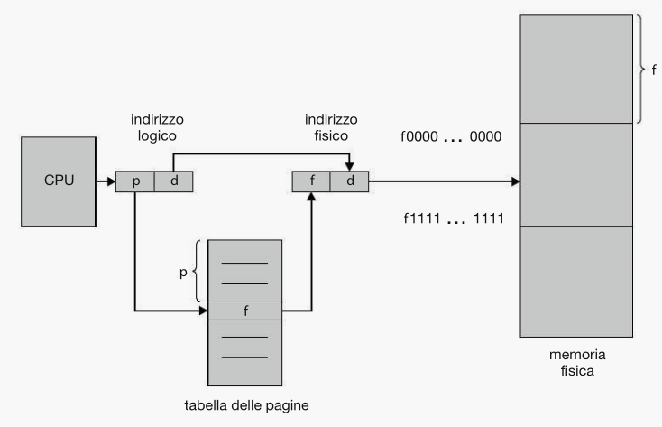

Domanda:
La gestione della memoria paginata in un sistema di elaborazione monoprocessore: se ne dia la
definizione e se ne presenti la realizzazione e la gestione, evidenziandone caratteristiche, vantaggi
e limiti.

Risposta:

La paginazione è uno schema di gestione della memoria, questo metodo permette di suddividere la memoria in due parti:
  * Pagine -> blocchi di dimensione pari a quella dei frame che si trovano in memoria logica (Processi)
  * Frame -> blocchi di dimensione fissa in memoria fisica (RAM)

Ogni indirizzo generato dalla CPU, quindi un indirizzo logico, deve essere tradotto per poi andare a trovarlo in memoria fisica,
per farlo vengono utilizzati diversi strategemmi, il primo di questi è il numero di pagina e un offset di pagina, il numero della
pagina serve come indice della tabella delle pagine e l'offset invece serve per andare a cercare all'interno del frame fisico
l'informazione che serve al processo.

  

